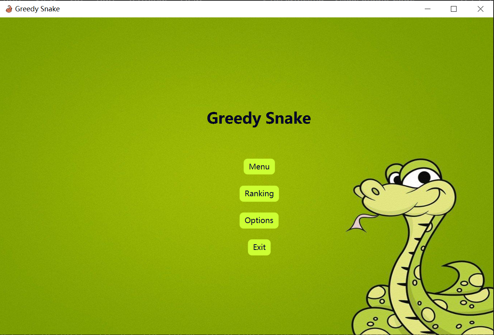
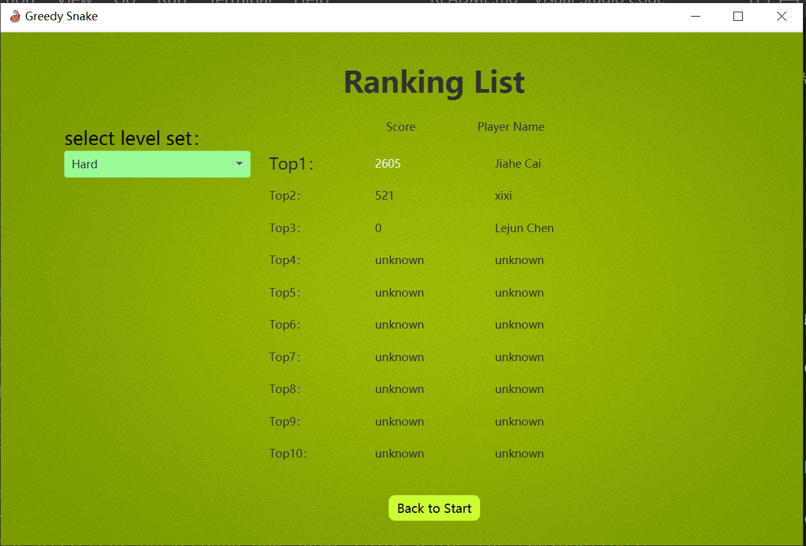
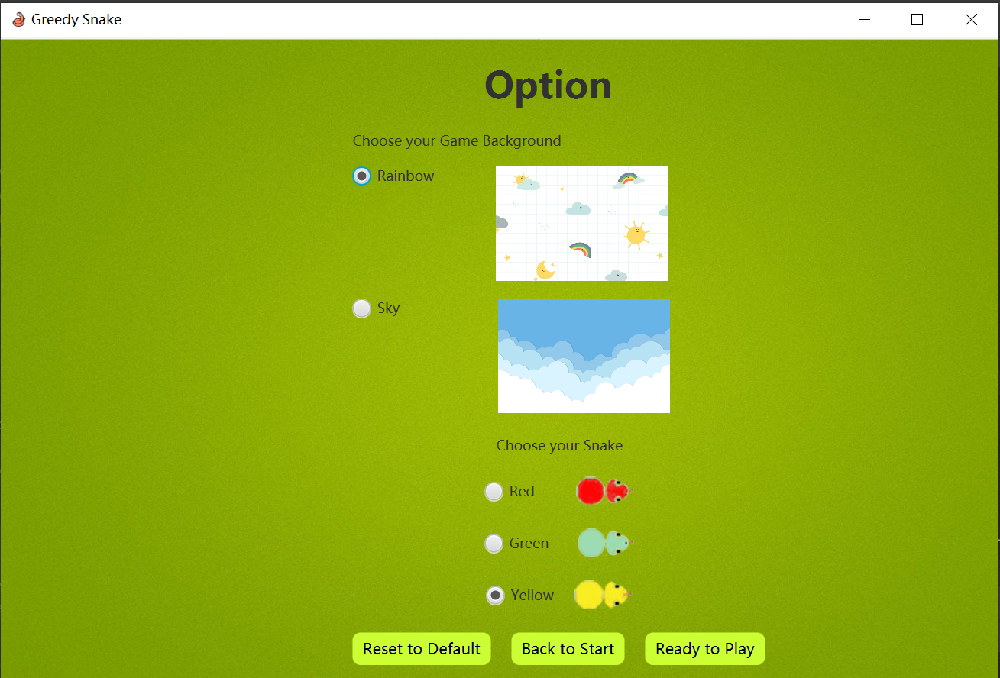
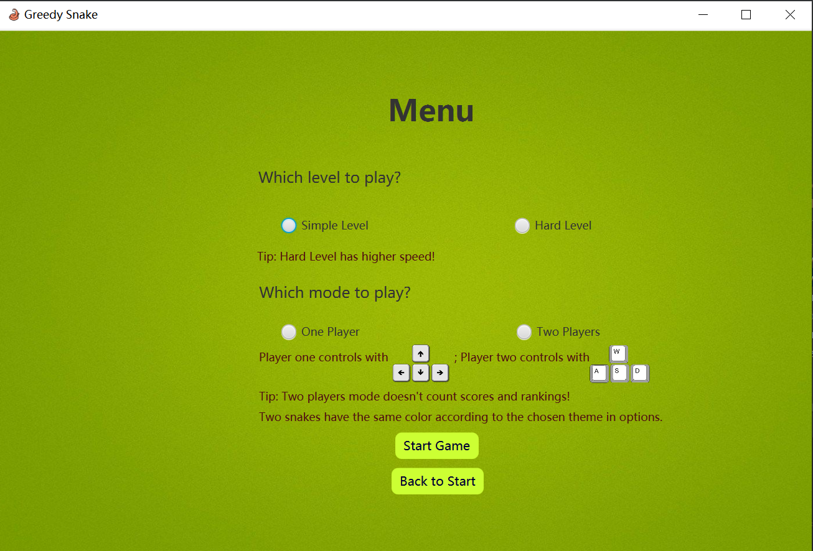
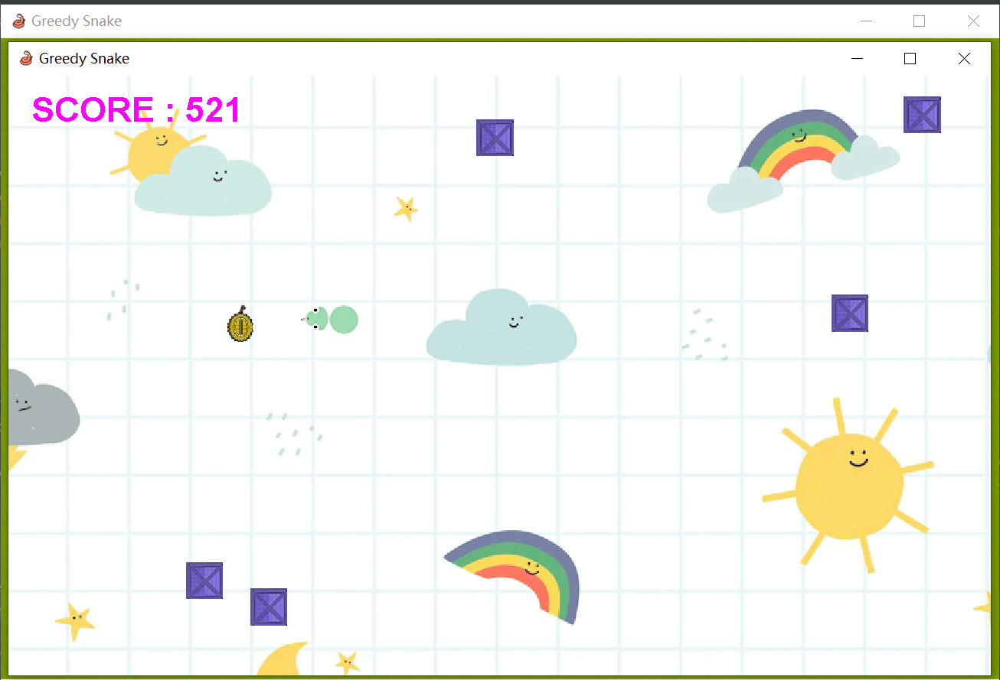
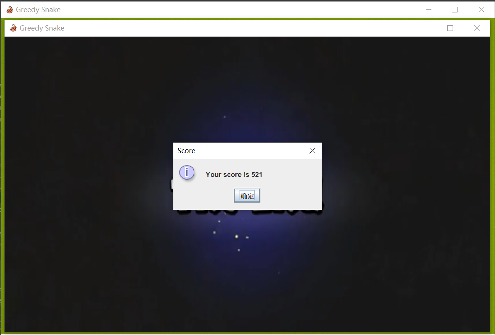
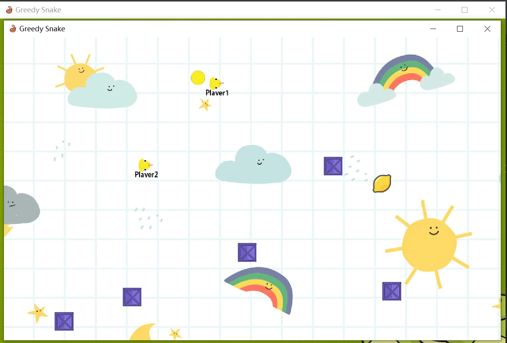
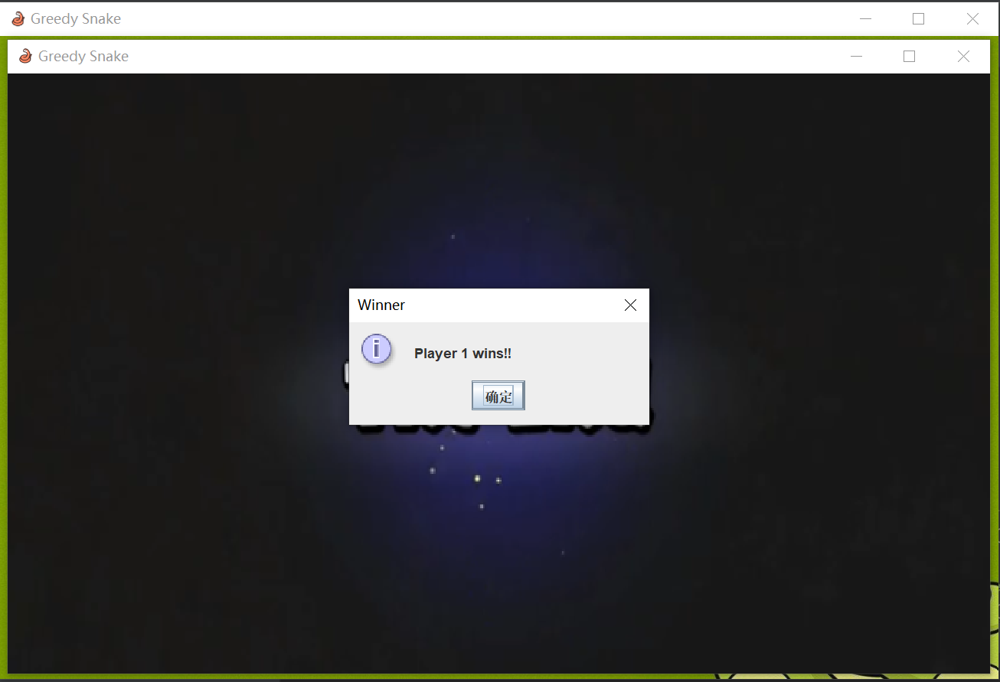
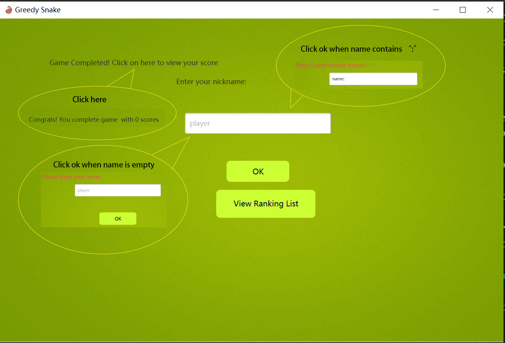
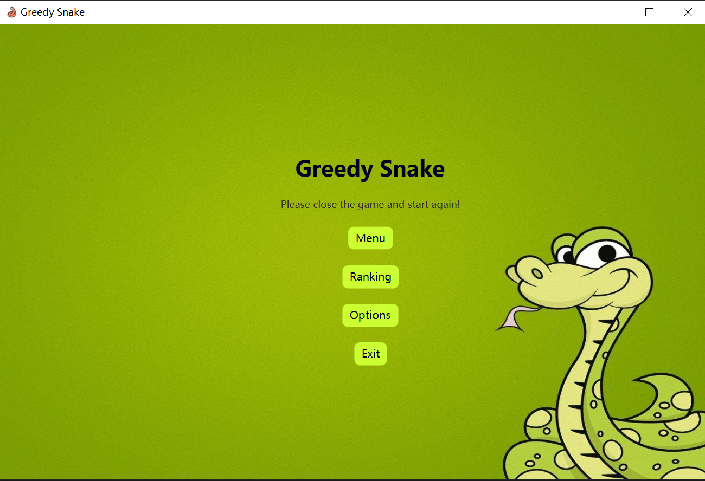

# Project Name: SnakeGame Author: Jiahe Cai 20319912

This project is Develop Maintainable Software coursework, greedy snake game.
This project contains game code and test code in "src" document.
This game is a simple greedy snake game using JavaFX and Swing.


## Execute

Run with JavaFX

To install and run this project, you should apply VM option,

```
--module-path "$JAVAFX_PATH$" --add-modules javafx.controls,javafx.fxml,javafx.web
```

Run with Maven:

Install **all necessary plugin and dependency**.

To run with Maven, you should use the follow option:

```
javafx:run
```

or type "mvn clean javafx:run" in terminal.

## Guidance on playing

### After successfully installing and running the project, the start page shows. 


### Click Button "Ranking" on start page to go to rank page to view the current existing scores by players. 
- In the current rank page, the above choiceBox allows to present different rankings based on different level of the game. 
- In the rank page top 10 score and corresponding name are shown in descending order in the chosen level. If in the chosen level less than 10 players has the score stored, the remaining rank will show "unknown" in score and name.
- Click Button "Back to Start" to the start page.


### Click Button "Option" on start page to go to option page to choose themes in the game.
- In the current option page, the theme is initially set to default theme. Player can choose different background and snake color using the radiobuttons. 
- Click Button "Reset to Default" to set the theme to default theme. 
- Click Button "Back to Start" to go back to start page. 
- Click "Ready to Play" to go to menu page to choose game mode.


### Click Button "Menu" on start page to go to menu page to choose game mode.
- In the current menu page, player need to choose two mode for the game. 
- One is the game level. Simple level has low snake speed and hard level has high snake speed. 
- Another mode is one-player mode or two-player mode. One-player mode is one snake eating food and win higher score. Two-player mode is two snakes competing wuth each other. 
- Player must choose both two modes before they click Button "Start Game" otherwise the warning message will appear. If no warning message shows, another window will pop up showing the playing game scene. 
- Player can also click "Back to Start" button on menu page to go back to start page.


### In one-player mode, one snake exists in the game. 
- The snake moves with the control in keyboard up left right down. 
- If the snake moves to overlap with the random food image shown in the game, the length of snake body will increase one and this snake's score will add 571 shown on the upper left corner of the current window. 


- When the snake hit the obstacle in the image of box or hit the boundary of the current window, the game ends with a end scene picture shown and a pop-up message displays the player's score. After click ok on the pop-up message and closing the playing game window, the gameMsg page will shows.


### In two-player mode, two snakes exist in the game. 
- Player1's snake moves with the control in keyboard up left right down and player2's with w s a d in keyboard. Press w player2's snake moves up, a moves left, s moves down and d moves right. 
- Two snake have the same yellow color but with different name attached below the snake's head to distinguish with each other. 
- If the snake moves to overlap with the random food image shown in the game, the length of snake body will increase one. 


- When the snake hit itself, the other snake, boundary of the current window or the obstacle, this snake loose and the other snake wins. 
- When one player wins, the game ends with a end scene picture shown and a pop-up message displays which player wins. After click ok on the pop-up message and closing the playing game window, the start page will shows. 


- Note that as this mode is the competition, who dies who loose, no score counts and no rank list is provided.
### In the gameMsg page
- player can click the congradulation message in the first line to see the score again. Player can enter the nickname in the textfiled. The nickname can't be empty or contain ":". 
- If invalid nickname is entered, after click Button OK the warning will show up to ask for another nickname.   
- If nickname is valid, after click Button OK the message will show up to tell that the score and nickname are saved successfully. 
- Player can click Button "View Ranking List" to go to the rank page. If his/her score and name are saved successfully and the score is in top10 of this level, the rank page will display his/her score and name in the corresponding rank. 


#### If the player want to play again, he/she can close all the windows pop up and run the project again. 
- If player has played once and managed to reach start page again, a warning will display when player click Button Menu


#### If the player want to exit the game, he/she can click Button Exit on the start page, or close all the pop-up windows, the system will exit.

## Credits
- No third-party element were used
